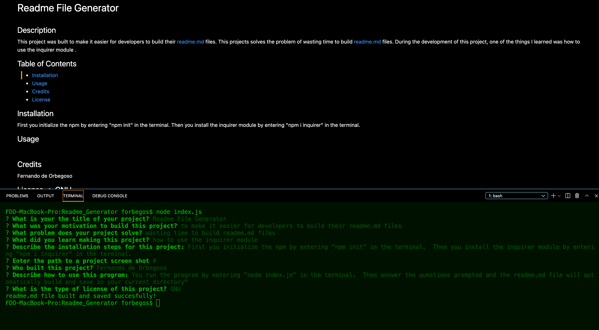

        
# Readme File Generator    

## Description

This project was built to make it easier for developers. This projects solves the problem of time spent building readme file. 
During the development of this project, one of the things I learned was the use of inquirer.

## Table of Contents

- [Installation](#installation)
- [Usage](#usage)
- [Credits](#credits)
- [License](#license)

## Installation

run npm init, npm i inquirer

## Usage

run node index.js

## Credits

Fernando de Orbegoso

## Github Repository

https://www.github.com/forbegos

## Contact Information

forbegos@me.com

## License: 
## 
